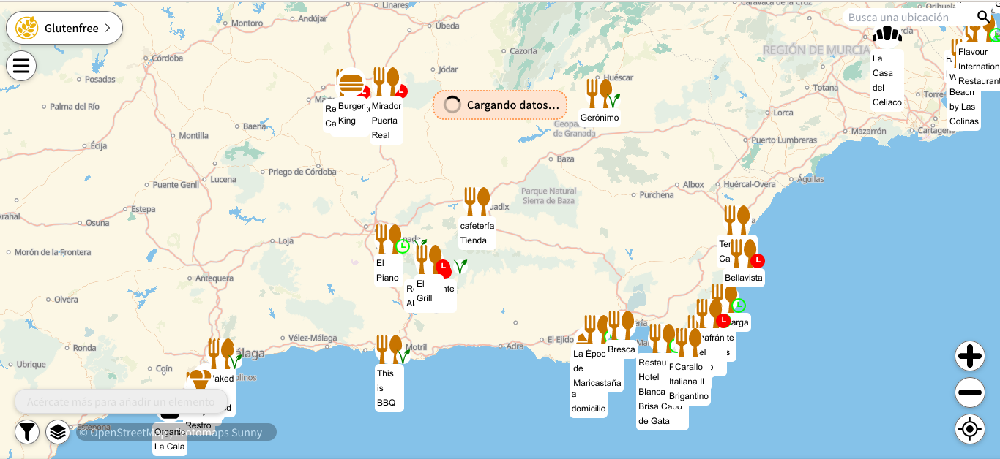

# Sin Gluten

Notas con recursos sin gluten. 

> Si hay algún recurso o lugar en los listados que creas que no debería estar o que falta por añadir, puedes enviarme un email a Senepedius@proton.me

## Indice
- [Mapa sin gluten (mundial)](#Mapa%20sin%20gluten%20(mundial))
- [Recursos sin gluten](#Recursos%20sin%20gluten)
- [Restaurantes y lugares sin gluten](#Restaurantes%20y%20lugares%20sin%20gluten)
## Mapa sin gluten (mundial)

### https://mapcomplete.org/glutenfree
En este mapa puedes **ver (e incluso añadir)** los diferentes lugares sin gluten en cualquier parte del mundo. 

> Este mapa está basado en datos de OpenStreetMaps, es libre y gratuito para todo el mundo y no depende de ninguna empresa privada que pueda cortar su acceso o cobrar por el en el futuro.

Intento mantener en este mapa todos los sitios que se incluyen en las listas que encontrarás en esta web. 

El mapa no es mío, no lo cree yo, pero sus datos son tuyos y de todos, así que si quieres ayudar, puedes.

## Recursos sin gluten 
Recopilación de webs o recursos que pueden interesarte.
[Enlaces-sin-gluten](Enlaces-sin-gluten.md)
## Restaurantes y lugares sin gluten
Listados de lugares, principalmente cafeterías y restaurantes sin gluten, agrupados por ciudad
### [Almería](./Almeria-Sin-Gluten.md)
### [Jaén](./Jaen-Sin-Gluten.md)
### [Málaga](./Malaga-Sin-Gluten.md)
### [Granada](./Granada-Sin-Gluten.md)

